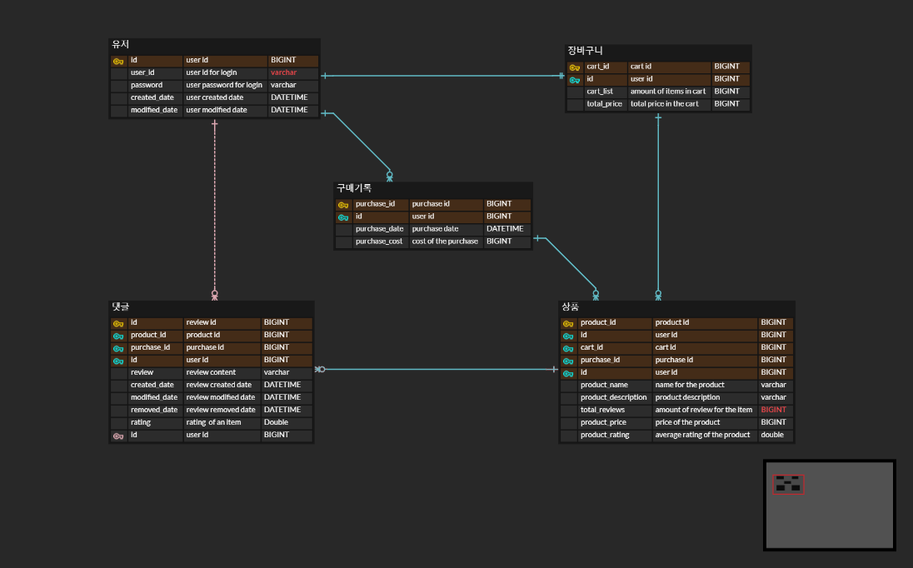

# 🗒 커머스 프로젝트

간단한 온라인 쇼핑몰 서비스입니다. 

## 프로젝트 기능 및 설계
- 회원가입 기능
  - 사용자는 회원가입을 할 수 있다. 
  - 회원가입시 아이디와 패스워드를 입력받으며, 아이디는 unique 해야한다. 

- 로그인 기능
  - 사용자는 로그인을 할 수 있다. 로그인시 회원가입때 사용한 아이디와 패스워드가 일치해야한다. 

- 상품명 검색 기능 
  - 로그인하지 않은 사용자를 포함한 모든 사용자는 상품을 조회할수 있다.
  - 원하는 상품의 이름을 검색헐수 있는 기능

- 상품 장바구니 기능
  - 로그인을 한 사용자만 장바구니를 사용할수 있다.
  - 상품을 장바구니에 담거나, 장바구니를 조회하거나, 상품을 장바구니에서 삭제할수 있다.

- 구매한 기록 조회 기능
  - 로그인을 한 사용자만 구매한 기록을 조회할수 있다.
  - 상품들을 구매한 기록을 최근에 구매했던 시간순으로 조회할수 있다. 

- 특정 상품명 조회 기능
  - 로그인하지 않은 사용자를 포함한 모든 사용자는 상품을 조회할수 있다.
  - 상품명, 상품 내용, 상품 가격이 조회된다. 

- 리뷰 목록 조회 기능
  - 특정 상품 조회시 리뷰목록도 함께 조회가 된다. 다만 댓글은 많을 수 있기 때문에 별도의 API로 구성한다. 이 또한 로그인하지 않은 사용자를 포함한 모든 사용자가 댓글을 조회할 수 있다.
  - 리뷰는 최신순으로만 정렬되며, paging 처리를 한다. 
  - 리뷰 목록 조회시에는 댓글 작성자와 댓글 내용, 댓글 작성일의 정보가 필요하다.

- 리뷰 작성 기능
  - 로그인한 사용자는 권한에 관계 없이 리뷰를 작성할 수 있다. 
  - 사용자는 리뷰 내용(텍스트)를 작성할 수 있다. 

## ERD 

